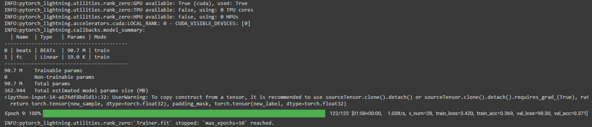

# Multi-Label Audio Classification BEATs Pipeline
Original paper: https://arxiv.org/abs/2212.09058

This document outlines the steps involved in a multi-label classification pipeline for an audio dataset. The pipeline leverages a fine-tuned BEATs model for feature extraction and t-SNE for dimensionality reduction and visualization.

1. **Feature Extraction**
2. **Classification**
3. **Next Steps**

# Feature Extraction
## Pipeline Overview

The pipeline processes audio data to perform multi-label classification by:
1. Loading a pre-trained BEATs model.
2. Extracting features from the audio data.
3. Reducing the dimensionality of these features using t-SNE.
4. Visualizing the results in a scatter plot.

## Steps in the Pipeline

### 1. Model Loading

**Function:** `loadBEATs`

**Description:**
- Loads the pre-trained BEATs model from a specified checkpoint.
- Initializes the model with the appropriate configuration.
- Sets the model to evaluation mode.

```python
def loadBEATs():
    # Load the pre-trained checkpoints
    finetuned_1 = torch.load()

    cfg = BEATsConfig(finetuned_1['cfg'])
    BEATs_model = BEATs(cfg)
    BEATs_model.load_state_dict(finetuned_1['model'])
    BEATs_model.eval()
    return BEATs_model
```

### 2. Feature Extraction
**Function:** `extractFeatures`

**Description:**

- Iterates over the audio data (trs).
- Creates a padding mask for each sample.
- Extracts features using the BEATs model.
- Handles the dimensionality of the output representation.

```python
def extractFeatures(BEATs_model, trs):
    for t in trs:
        padding_mask = torch.zeros(t.shape[0], t.shape[1]).bool()
        representation = BEATs_model.extract_features(t, padding_mask=padding_mask)[0]
        if representation.dim() == 3:
            representation = representation[:, -1, :]
        yield representation.detach().numpy()
```
### 3. Dimensionality Reduction with t-SNE
**Function:** `get_2d_features`

**Description:**

- Concatenates the extracted features into a single representation.
- Applies t-SNE to reduce the dimensionality of the features to 2D.
- Sets the perplexity parameter appropriately.
```python
def get_2d_features(features, perplexity):
    representation = np.concatenate(np.array(features), axis=0)
    tsne = TSNE(n_components=2, perplexity=perplexity)
    features_2d = tsne.fit_transform(representation)
    return features_2d
```
### 4. Label Flattening
**Function:** `flatten_labels`

**Description:**

- Iterates through the multi-label data.
- Retains samples with a single non-None label.
- Discards samples with multiple or no labels for simplification.
```python
def flatten_labels(features_2d, labels):
    flattened_labels = []
    flattened_features = []
    for i in range(len(labels)):
        row = labels[i]
        non_none_labels = [label for label in row if label is not None]
        if len(non_none_labels) == 1:
            flattened_labels.append(non_none_labels[0])
            flattened_features.append(features_2d[i])
    return flattened_labels, flattened_features
```

### 5. Visualization
**Function:** `get_figure`

**Description:**

- Creates a scatter plot using Seaborn.
- Colors the points based on their labels.
- Moves the legend to the upper left outside the plot for better clarity.
- Saves the plot as an image file.
```python
def get_figure(features_2d, labels, fig_name):
    fig = sns.scatterplot(x=features_2d[:, 0], y=features_2d[:, 1], hue=labels)
    sns.move_legend(fig, "upper left", bbox_to_anchor=(1, 1))
    fig.get_figure().savefig(fig_name, bbox_inches="tight")
```

## Main Execution Flow
In the main execution flow, these functions are called in sequence to process the audio data, extract features, reduce dimensionality, flatten labels, and visualize the results:
```python
print("[INFO] Processing the audio")
trs = raw # raw wave data (not spectrograms)

print("[INFO] Loading the BEATs model")
BEATs_model = loadBEATs()

print("[INFO] Getting the features")
features = list(extractFeatures(BEATs_model, trs))

features_2d = get_2d_features(features, perplexity=30)
flattened_labels, flattened_features = flatten_labels(features_2d, labels)

fig_name = 'tsne.png'

print("[INFO] Making the figure")
flattened_features = np.array(flattened_features)
flattened_labels = np.array(flattened_labels)

get_figure(flattened_features, flattened_labels, fig_name)
files.download(fig_name)
```

**Initial Approach**

Flatten the labels for each data point to 1 (pick an arbitrary label it holds) & plot the feature map.


**Refined Approach**

To better test the feature extraction from the BEATs model, we only plot the data points that contain 1 label & plot its feature map.


**NOTE:** 
- This is a tokenization map. No clustering or classifcation has been applied.

# Classification

The goal is to have the following classification process:

## Feature Extraction:

Use pre-trained BEATs_model to extract features from new audio files. This will provide a feature representation for each new audio file.

## Prediction:
- Use model to predict labels for the new data points based on their extracted features.

- Will involve passing extracted features through and obtaining probability scores for each label.

- Evaluate the performance of predictions against ground truth labels if available.

- Metrics such as precision, recall, F1-score, and accuracy can be used to assess the model's performance on the new data points.

## Models
In terms of the models, we can finetune the BEATs model on our dataset, or test with a pre-finetuned one.

### Pre-Finetuned BEATs
In the following code (/fine_tune/transfer.learning.py), we test with a regular BEATs model that is pre-finetuned.

```python
class BEATsTransferLearningModel(pl.LightningModule):
    def __init__(self, batch_size=32, milestones=5, num_classes=36, num_workers=11, lr_scheduler_gamma=1e-1, lr=1e-3, ft_entire_network=False):
        super().__init__()
        self.lr = lr
        self.lr_scheduler_gamma = lr_scheduler_gamma
        self.num_workers = num_workers
        self.batch_size = batch_size
        self.milestones = milestones
        self.num_classes = num_classes
        self.ft_entire_network = ft_entire_network

        self.checkpoint = torch.load('/content/drive/MyDrive/BEATs/BEATs_iter3_plus_AS2M_finetuned_on_AS2M_cpt1.pt')
        self.cfg = BEATsConfig(self.checkpoint["cfg"])

        self._build_model()

        self.train_acc = tf.keras.metrics.CategoricalAccuracy(name='train_acc')
        self.valid_acc = tf.keras.metrics.CategoricalAccuracy(name='valid_acc')
        self.loss_func = tf.keras.losses.CategoricalCrossentropy(from_logits=True)

        # self.train_acc = Accuracy(
        #     task="multiclass", num_classes=self.num_classes
        # )
        # self.valid_acc = Accuracy(
        #     task="multiclass", num_classes=self.num_classes
        # )
        self.save_hyperparameters()

    def _build_model(self):
        self.beats = BEATs(self.cfg)
        self.beats.load_state_dict(self.checkpoint["model"])

        self.fc = nn.Linear(527, self.num_classes)

    def extract_features(self, x, padding_mask=None):
        if padding_mask is not None:
            x, _ = self.beats.extract_features(x, padding_mask)
        else:
            x, _ = self.beats.extract_features(x)
        return x

    def forward(self, x, padding_mask=None):
        if padding_mask is not None:
            x, _ = self.beats.extract_features(x, padding_mask)
        else:
            x, _ = self.beats.extract_features(x)

        x = self.fc(x)
        x = x.mean(dim=1)

        return x

    def loss(self, lprobs, labels):
        self.loss_func = nn.CrossEntropyLoss()
        return self.loss_func(lprobs, labels)

    def training_step(self, batch, batch_idx):
        x, padding_mask, y_true = batch
        y_probs = self.forward(x, padding_mask)
        train_loss = self.loss(y_probs, y_true)
        
        self.train_acc.update_state(y_true.cpu().numpy(), y_probs.detach().cpu().numpy())
        train_acc = self.train_acc.result().numpy()
        
        self.log("train_loss", train_loss, prog_bar=True)
        self.log("train_acc", train_acc, prog_bar=True)
        return train_loss

    def validation_step(self, batch, batch_idx):
        x, padding_mask, y_true = batch
        y_probs = self.forward(x, padding_mask)
        val_loss = self.loss(y_probs, y_true)
        
        self.valid_acc.update_state(y_true.cpu().numpy(), y_probs.detach().cpu().numpy())
        val_acc = self.valid_acc.result().numpy()
        
        self.log("val_loss", val_loss, prog_bar=True)
        self.log("val_acc", val_acc, prog_bar=True)

    def configure_optimizers(self):
        if self.ft_entire_network:
            optimizer = optim.AdamW(
                [{"params": self.beats.parameters()}, {"params": self.fc.parameters()}],
                lr=self.lr,
                betas=(0.9, 0.98),
                weight_decay=0.01,
            )
        else:
            optimizer = optim.AdamW(
                self.fc.parameters(), lr=self.lr, betas=(0.9, 0.98), weight_decay=0.01
            )

        return optimizer
```

These are the run stats for 10 epochs and batch size of 8/32. The validation and training loss are currently unnormalized so it is quite high.



This is another run with 45% accuracy, eventually got up to 63% with some hyperparameter tweaks.


Next steps will be hyperparameter tuning and running more epochs to fine tune on our dataset.

## Fine Tuning Pipeline

### Purpose
These files are designed for finetuning and training using PyTorch Lightning. The fine tuning pipeline is setup across the 4 subfolders within this directory.

### Components
1. Data Handling:
- AercousticsDataset: Custom dataset class for loading and transforming audio data and labels.
- AercousticsDataModule: Manages data loading, preprocessing, and splitting into training, validation, and test sets.

2. Model:
- BEATsTransferLearningModel: A PyTorch Lightning module for transfer learning with the BEATs model. Includes methods for feature extraction, forward pass, and loss calculation. Supports optional finetuning of the entire network.

3. Finetuning:
- MilestonesFinetuning: Custom class for managing model finetuning based on specified milestones. Handles freezing and unfreezing layers during training.

4. CLI Interface:
- MyLightningCLI: Custom command-line interface for configuring and running the training process with PyTorch Lightning.

### Execution
- Entry Point: cli_main() function initializes and runs the CLI for training the model.

# Next Steps
Time to spam data on the VM
